# AR 안경 기반 협동로봇 Teleop/VLA 프로젝트

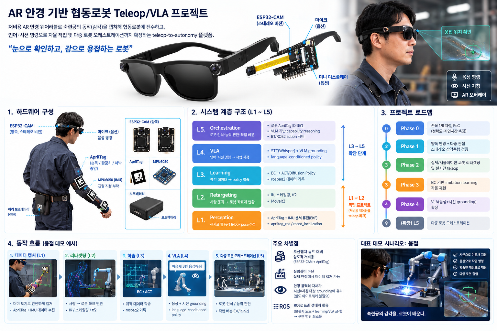

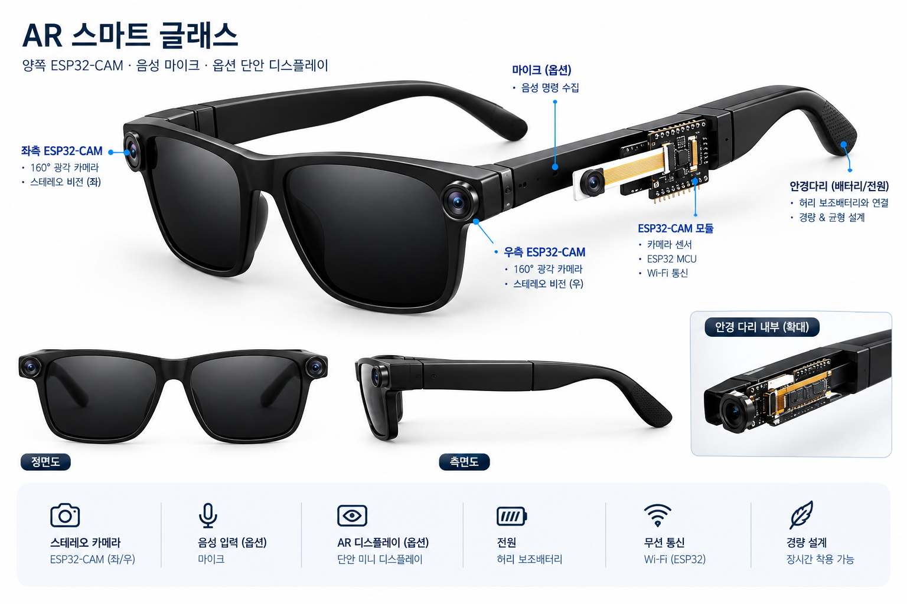 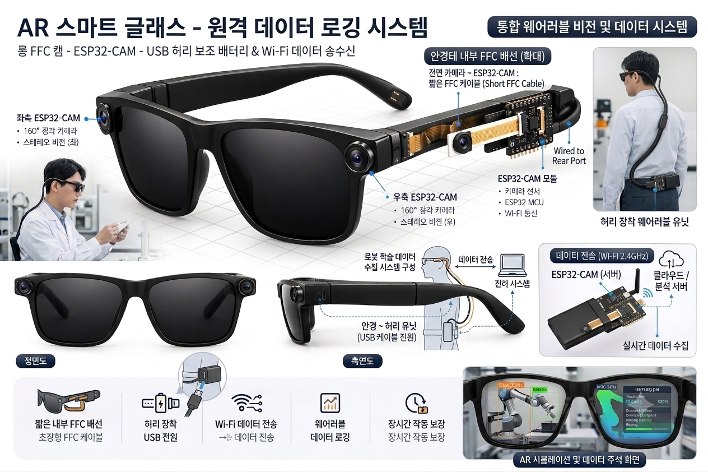

---

## 한 줄 컨셉
- 저비용 AR 안경 웨어러블로 숙련공의 동작(감각)을 캡처해 협동로봇에 전수하고,
- 언어·시선 명령으로 자율 작업 및 다중 로봇 오케스트레이션까지 확장하는 teleop-to-autonomy 플랫폼.

## 태그라인
- "눈으로 확인하고, 감으로 용접하는 로봇"

## 하드웨어 구성
- 안경 양쪽 ESP32-CAM (스테레오 비전) + 허리 보조배터리 전원
- 손목 / 팔꿈치(또는 하박 중앙)에 AprilTag 부착
- 관절 지점에 MPU6050(IMU) 추가 → 비전-IMU 센서 퓨전으로 occlusion 보완, 샘플링레이트 향상
- (확장) 안경 마이크 → 음성 명령, (확장) 단안 미니 디스플레이 → AR 오버레이

---
## Tag Glove

### Version 0.1
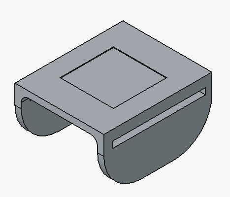

### Version 0.2
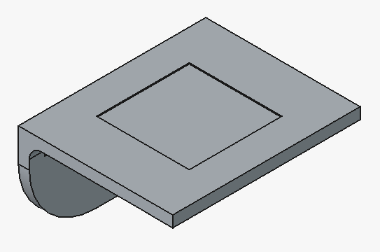 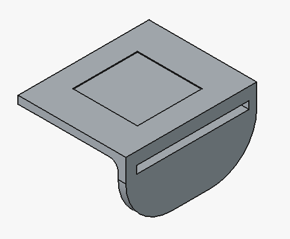

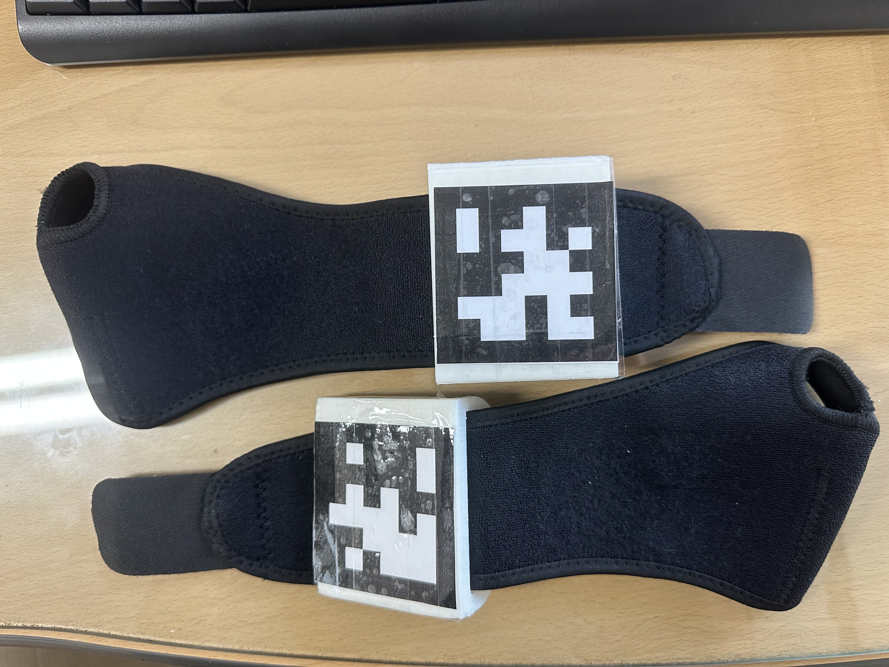 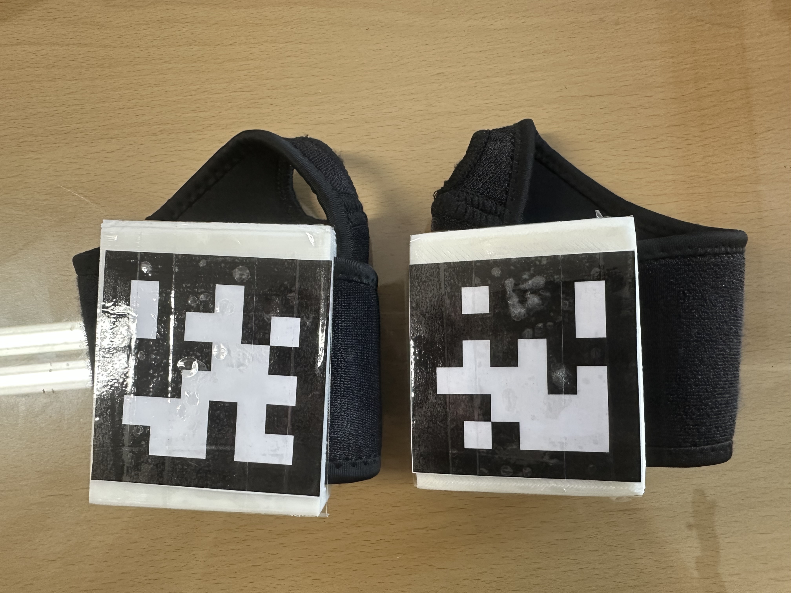 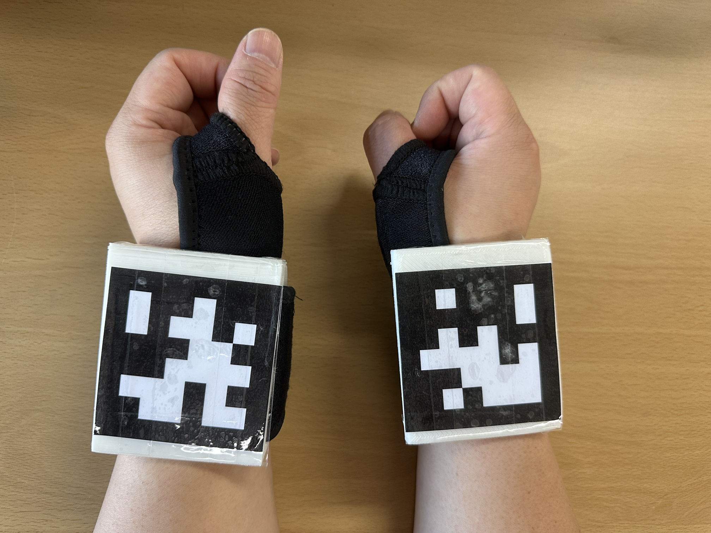

---
## AR Glass

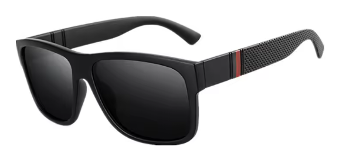 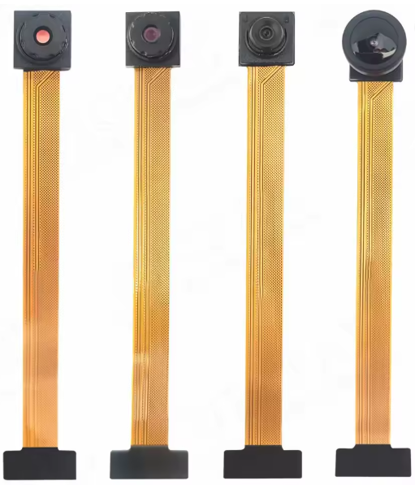 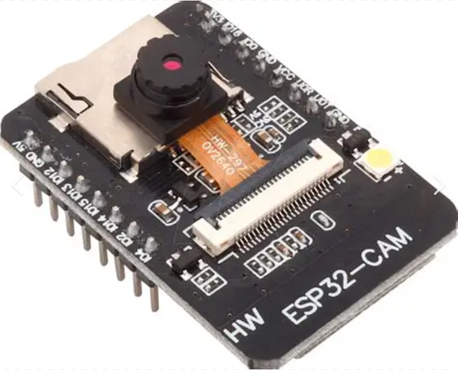

## CAM Test

* http://192.168.0.137/
* http://192.168.0.69/

---
## 투명 LCD 
- [유튜브링크](https://www.youtube.com/results?search_query=%ED%88%AC%EB%AA%85LCD+%EC%9E%90%EC%9E%91)

---

## 계층 구조 (L1~L5)

| 계층 | 역할 | 핵심 기술 |
|---|---|---|
| L1. Perception | 센서로 팔 동작 6-DoF pose 추정 | AprilTag + IMU 센서 퓨전(EKF), ROS2 `apriltag_ros`/`robot_localization` |
| L2. Retargeting | 사람 동작 → 로봇 좌표계 변환 | IK, 스케일링, `tf2`, `MoveIt2` |
| L3. Learning | 궤적 데이터 → policy 학습 | BC → ACT/Diffusion Policy, `rosbag2` 데이터 기록 |
| L4. VLA | 언어·시선 명령 → 작업 지정 | STT(Whisper) + VLM grounding, language-conditioned policy |
| L5. Orchestration | 로봇 인식·능력 판단·작업 배분 | 로봇 AprilTag ID 태깅, VLM 기반 capability reasoning, BT/ROS2 action 서버 |

L1~L2만으로도 독립적인 프로젝트(저비용 웨어러블 teleop 리그)가 성립하며, L3~L5는 순차적 확장.

## 로드맵
- Phase 0: 손목 1개 지점, PoC(정확도·지연시간 측정)
- Phase 1: 양쪽 안경 + 다중 관절, 스테레오 삼각측량 검증
- Phase 2: 실제/시뮬레이션 코봇 리타겟팅 및 실시간 teleop
- Phase 3: BC 기반 imitation learning, 자율 재현
- Phase 4: VLA(음성+시선 grounding) 확장
- (확장) L5 다중 로봇 오케스트레이션

## 핵심 차별점
- 모션캡처 슈트 대비 압도적 저비용(ESP32-CAM+AprilTag)
- 실험실이 아닌 실제 현장에서 데이터 캡처 가능
- 안경 폼팩터 자체가 시선=지칭 대상 grounding에 유리 (별도 아이트래커 불필요)
- ROS2 표준 생태계(apriltag_ros, robot_localization, MoveIt2, rosbag2, 코봇 공식 드라이버) 활용으로 직접 구현 범위를 브릿지 노드 + learning/VLA 로직으로 최소화

## "감을 느끼는 로봇" 컨셉
- 용접처럼 작업 중 시야가 가려지는(불꽃, 스패터) 환경을 전제로 설계
- 학습은 불꽃 없는 안전한 상태(더미 토치 리허설)에서 다양한 조건(이음새 각도, 틈새 폭)별로 반복 시연 → 조건-대응 패턴을 학습(단순 궤적 암기가 아님)
- 실전에서는 "확인(눈)": 작업 직전 비전으로 조건 인식 → "실행(감)": 학습된 policy가 조건에 맞춰 속도/각도/위빙을 스스로 미세조정해 수행
- 즉 암묵지(tacit knowledge)를 규칙이 아닌 학습으로 구현한다는 것이 기술적 본질이며, 로봇러닝의 generalization과 정확히 일치

## 사업화 시나리오 후보 (우선순위 순)

1. **숙련공 동작 전수 서비스** — 고령화·인력난 산업(용접·조립 등)에서 티칭 시간 단축. 로봇 판매가 아닌 티칭 서비스/솔루션. 27년 정밀 장비 이력과 직결
2. **원격 전문가 파견 대체** — 특수 장비(반도체/의료기기/방산) 정비 출장을 원격 시연-재현으로 대체. HoloLens 원류 스토리와 가장 가까움
3. **다품종 소량생산 즉석 재배치** — 중소 제조업 대상 노코드 로봇 재교육 솔루션. 시장은 넓으나 기존 코봇 티칭 업체와 경쟁
4. **교육기관 숙련도 전수 플랫폼** — 기존 강사/커리큘럼 사업과 직결, 리스크 낮으나 시장 규모 상대적으로 작음

## 대표 데모 시나리오: 용접

- 문제: 용접은 토치 각도·속도·위빙 패턴이 숙련공의 감각 영역이라 매뉴얼화·티칭이 어렵고, 인력난이 특히 심각(뿌리산업)
- 흐름: 더미 토치로 안전하게 캡처(L1) → 조건별 궤적/속도 리타겟팅(L2, 시간축 정밀도 중요) → BC/ACT로 학습(L3) → 음성+시선으로 이음새 지정, seam tracking으로 재확인(L4) → 다중 로봇 배분(L5)
- 표적 고객: 조선, 자동차 부품, 철골 구조물 등 다품종 소량 용접을 하는 중소 뿌리산업 업체
- 초기 포지셔닝: 완전 자율 용접이 아닌 "티칭 보조 툴"(기존 SI업체·로봇업체에 보완재로 제시)
- 리스크: 실제 아크 환경에서 ESP32-CAM/AprilTag 신뢰성 미검증(더미 토치 리허설로 시작), 용접 품질은 궤적만으로 완전 보장 안 됨(전류·속도·와이어 송급 데이터는 장기 과제)

## 다음으로 채울 것
- 구체적 킬러 데모 태스크 1개 확정 (예: 특정 이음새 용접 재현)
- Phase 0 MVP의 BOM·배선·실험 계획 구체화
- 실패 조건과 플랜 B 정의 (스테레오 정확도 부족 시, occlusion 과다 시 등)
