# AR 안경 기반 협동로봇 Teleop/VLA 프로젝트


 

---

## 한 줄 컨셉
- 저비용 AR 안경 웨어러블로 숙련공의 동작(감각)을 캡처해 협동로봇에 전수하고,
- 언어·시선 명령으로 자율 작업 및 다중 로봇 오케스트레이션까지 확장하는 teleop-to-autonomy 플랫폼.

## 태그라인
- "눈으로 확인하고, 감으로 용접하는 로봇"

## 하드웨어 구성
- 안경 양쪽 ESP32-CAM (스테레오 비전) + 허리 보조배터리 전원
- 손목 / 팔꿈치(또는 하박 중앙)에 AprilTag 부착
- 관절 지점에 MPU6050(IMU) 추가 → 비전-IMU 센서 퓨전으로 occlusion 보완, 샘플링레이트 향상
- (확장) 안경 마이크 → 음성 명령, (확장) 단안 미니 디스플레이 → AR 오버레이

---
## 1. Tag Glove (70mm * 70mm)

### Version 0.1

   * 제작시 한쪽이 부러지는 문제와, 착용성이 좋지 않음.


### Version 0.2

   * 오른쪽과 왼쪽으로 분리 : 착용의 편의성 개선

 

  


---

## 2. AR Glass

  

### 1. CAM Test

* 오른쪽 왼쪽 카메라 테스트

   * 교실 : http://192.168.0.137/ , http://192.168.0.69/
   * 연구실 : http://192.168.1.5/ , http://192.168.1.7/

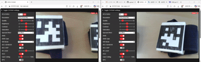

### 2. CAM Holder Design & Assemble.

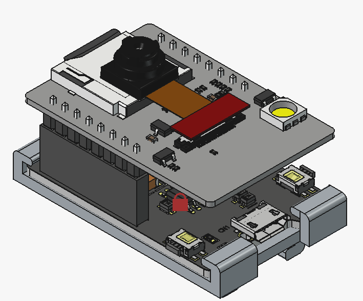 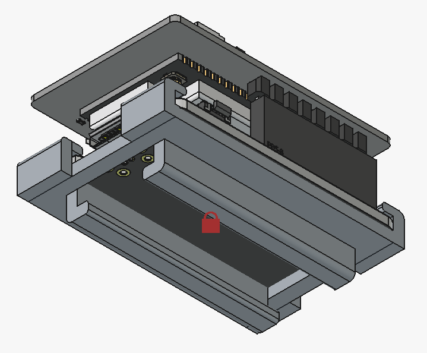 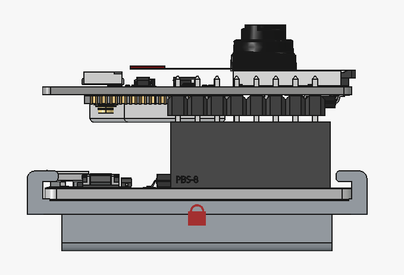 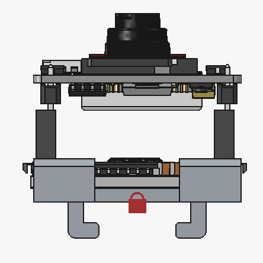

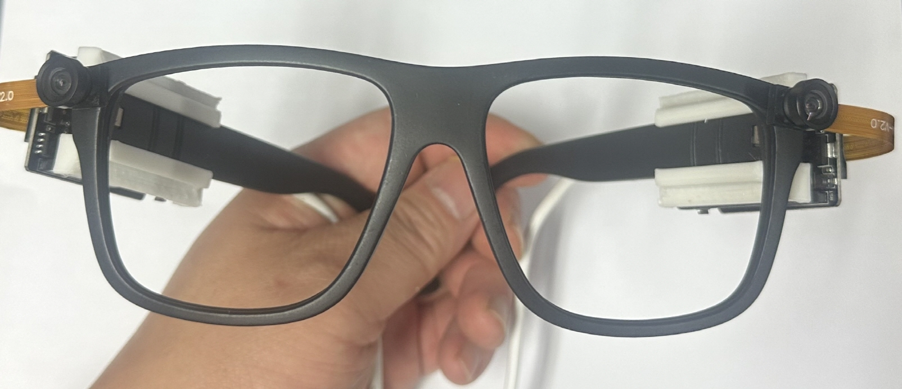 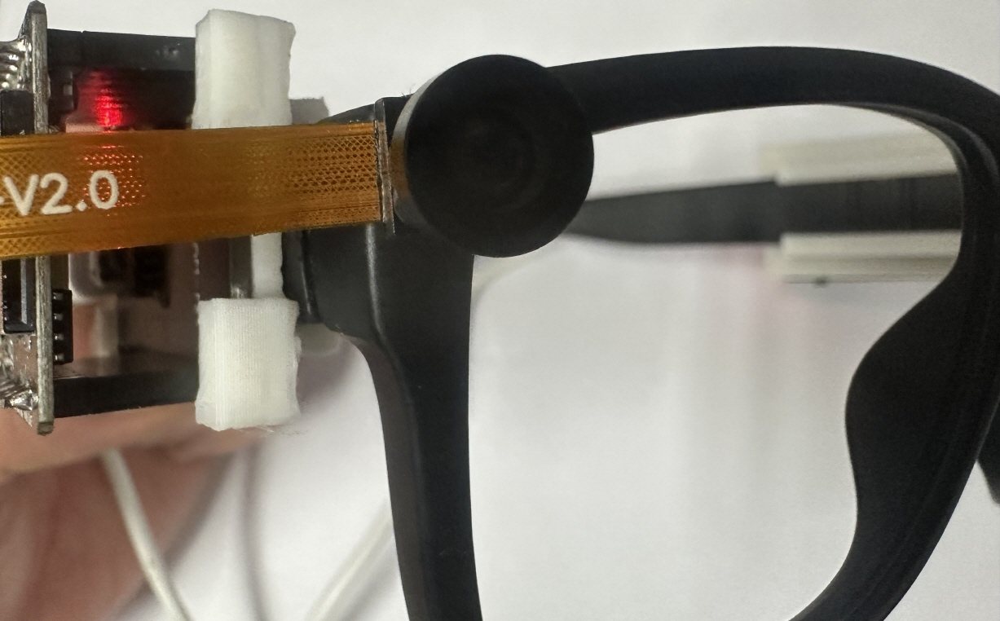 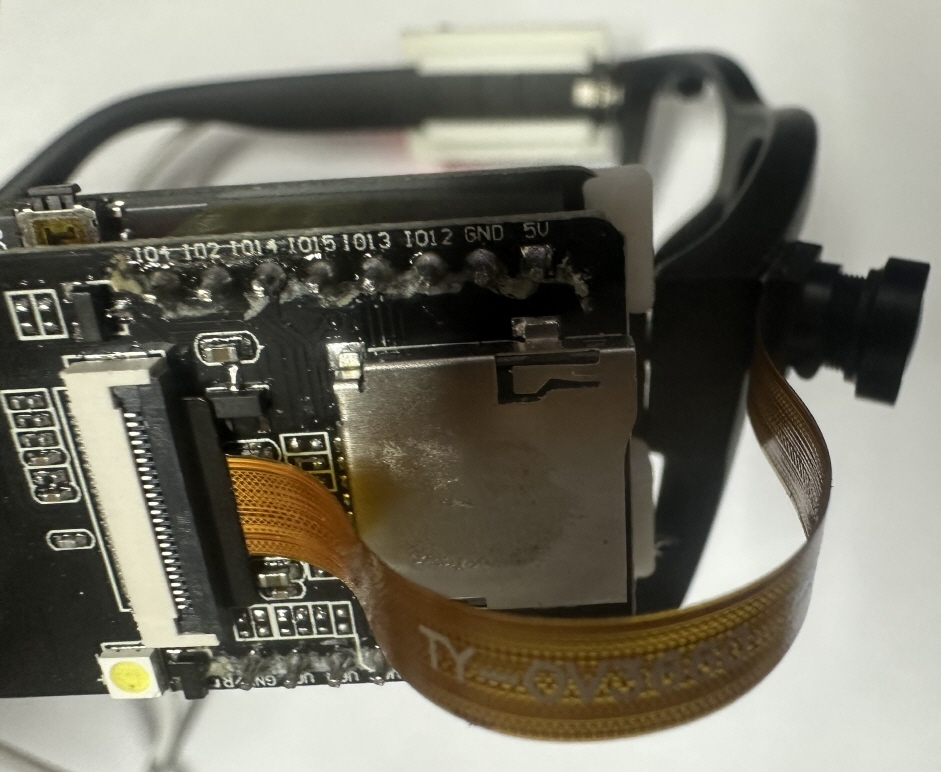 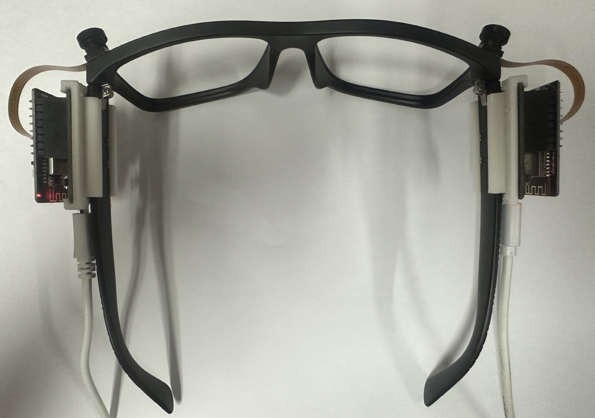

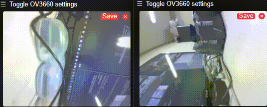


---

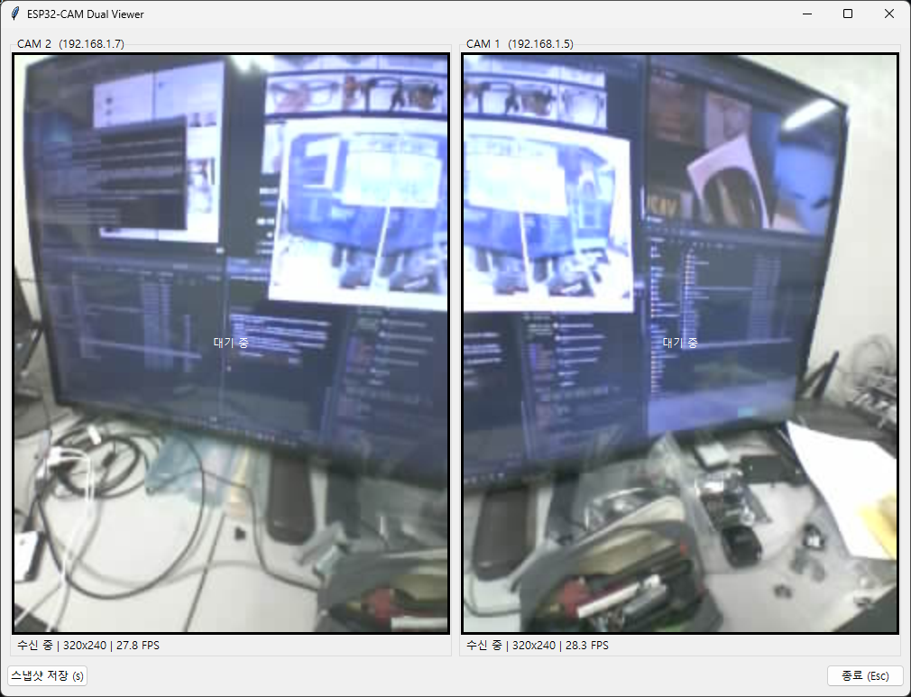

[esp32cam_dual_viewer.py](esp32cam_dual_viewer.py)

```
#!/usr/bin/env python3
"""
ESP32-CAM 2대 MJPEG 스트림을 하나의 Tkinter UI에 표시

설치:  pip install requests pillow
실행:  python esp32cam_dual_viewer.py

- 스트림 주소: http://<IP>:81/stream  (CameraWebServer 기본)
- 카메라마다 별도 스레드로 수신, 끊기면 자동 재연결
- 's' 키 또는 [스냅샷 저장] 버튼: 현재 프레임을 snapshots/ 폴더에 저장
"""

import io
import os
import threading
import time
import tkinter as tk
from datetime import datetime
from tkinter import ttk

import requests
from PIL import Image, ImageTk

# ------------------------------------------------------------------ 설정
CAMERAS = [
    # rotate: 시계 방향이 +, 반시계 방향이 - (단위: 도, 90 단위만 지원)
    {"name": "CAM 2", "host": "192.168.1.7", "rotate": -90},   # 왼쪽
    {"name": "CAM 1", "host": "192.168.1.5", "rotate": 90},    # 오른쪽
]
STREAM_PORT = 81
STREAM_PATH = "/stream"
DISPLAY_SIZE = (480, 640)      # 카메라당 표시 영역 (가로, 세로) - 90도 회전하면 세로가 길어짐
UI_REFRESH_MS = 30             # UI 갱신 주기
STALE_SEC = 3.0                # 이 시간 동안 프레임 없으면 '끊김' 표시
SNAPSHOT_DIR = "snapshots"
# ----------------------------------------------------------------------


def rotate_img(img, deg):
    """시계 방향 +deg 회전 (PIL의 rotate는 반시계가 +이므로 부호 반전)"""
    deg %= 360
    if deg == 0:
        return img
    return img.rotate(-deg, expand=True)


def fit_to_box(img, size):
    """비율을 유지한 채 size 안에 맞추고 나머지는 검은색으로 채움"""
    scale = min(size[0] / img.width, size[1] / img.height)
    new_w, new_h = max(1, int(img.width * scale)), max(1, int(img.height * scale))
    img = img.resize((new_w, new_h), Image.BILINEAR)
    canvas = Image.new("RGB", size, "black")
    canvas.paste(img, ((size[0] - new_w) // 2, (size[1] - new_h) // 2))
    return canvas


class CamWorker(threading.Thread):
    """MJPEG 스트림을 받아 최신 프레임(PIL.Image)만 보관하는 스레드"""

    def __init__(self, name, host):
        super().__init__(daemon=True)
        self.name = name
        self.url = f"http://{host}:{STREAM_PORT}{STREAM_PATH}"
        self._stop_evt = threading.Event()
        self._lock = threading.Lock()
        self._frame = None
        self._frame_time = 0.0
        self._fps = 0.0
        self.status = "연결 중..."

    # ---- 외부에서 호출
    def get_frame(self):
        with self._lock:
            return self._frame, self._frame_time, self._fps

    def stop(self):
        self._stop_evt.set()

    # ---- 스레드 본체
    def run(self):
        while not self._stop_evt.is_set():
            try:
                self.status = "연결 중..."
                with requests.get(self.url, stream=True, timeout=(3, 5)) as resp:
                    resp.raise_for_status()
                    self.status = "수신 중"
                    self._read_mjpeg(resp)
            except Exception as e:  # 네트워크 오류 등
                self.status = f"오류: {type(e).__name__}"
            # 재연결 전 잠깐 대기
            self._stop_evt.wait(1.5)

    def _read_mjpeg(self, resp):
        buf = b""
        t0, n = time.time(), 0
        for chunk in resp.iter_content(chunk_size=1024):
            if self._stop_evt.is_set():
                return
            if not chunk:
                continue
            buf += chunk
            while True:
                soi = buf.find(b"\xff\xd8")          # JPEG 시작
                if soi == -1:
                    buf = buf[-1:]
                    break
                eoi = buf.find(b"\xff\xd9", soi + 2)  # JPEG 끝
                if eoi == -1:
                    buf = buf[soi:]
                    break
                jpg, buf = buf[soi:eoi + 2], buf[eoi + 2:]
                try:
                    img = Image.open(io.BytesIO(jpg))
                    img.load()
                except Exception:
                    continue  # 깨진 프레임은 버림
                n += 1
                now = time.time()
                with self._lock:
                    self._frame = img
                    self._frame_time = now
                    if now - t0 >= 1.0:
                        self._fps = n / (now - t0)
                        t0, n = now, 0


class App:
    def __init__(self, root):
        self.root = root
        root.title("ESP32-CAM Dual Viewer")
        root.protocol("WM_DELETE_WINDOW", self.on_close)
        root.bind("<Key-s>", lambda e: self.save_snapshots())
        root.bind("<Escape>", lambda e: self.on_close())

        self.workers = [CamWorker(c["name"], c["host"]) for c in CAMERAS]
        self.labels, self.info_vars, self.photos = [], [], [None] * len(CAMERAS)

        frame = ttk.Frame(root, padding=6)
        frame.pack(fill="both", expand=True)

        for i, c in enumerate(CAMERAS):
            box = ttk.LabelFrame(frame, text=f"{c['name']}  ({c['host']})")
            box.grid(row=0, column=i, padx=4, pady=4)
            lbl = tk.Label(box, width=DISPLAY_SIZE[0], height=DISPLAY_SIZE[1],
                           bg="black", fg="white", text="대기 중",
                           compound="center")
            # Label의 width/height는 이미지가 없을 때 '문자 단위'이므로 픽셀 지정용 빈 이미지 사용
            blank = ImageTk.PhotoImage(Image.new("RGB", DISPLAY_SIZE, "black"))
            lbl.configure(image=blank, width=DISPLAY_SIZE[0], height=DISPLAY_SIZE[1])
            lbl.image = blank
            lbl.pack()
            var = tk.StringVar(value="-")
            ttk.Label(box, textvariable=var).pack(anchor="w", padx=4, pady=2)
            self.labels.append(lbl)
            self.info_vars.append(var)

        bar = ttk.Frame(frame)
        bar.grid(row=1, column=0, columnspan=len(CAMERAS), sticky="ew", pady=4)
        ttk.Button(bar, text="스냅샷 저장 (s)", command=self.save_snapshots).pack(side="left")
        ttk.Button(bar, text="종료 (Esc)", command=self.on_close).pack(side="right")

        for w in self.workers:
            w.start()
        self.update_ui()

    def update_ui(self):
        now = time.time()
        for i, w in enumerate(self.workers):
            img, ts, fps = w.get_frame()
            alive = img is not None and (now - ts) < STALE_SEC
            if alive:
                rot = rotate_img(img.convert("RGB"), CAMERAS[i].get("rotate", 0))
                disp = fit_to_box(rot, DISPLAY_SIZE)
                self.photos[i] = ImageTk.PhotoImage(disp)
                self.labels[i].configure(image=self.photos[i])
                self.labels[i].image = self.photos[i]
                self.info_vars[i].set(f"{w.status} | {img.size[0]}x{img.size[1]} | {fps:.1f} FPS")
            else:
                self.info_vars[i].set(f"끊김 - {w.status}")
        self.root.after(UI_REFRESH_MS, self.update_ui)

    def save_snapshots(self):
        os.makedirs(SNAPSHOT_DIR, exist_ok=True)
        stamp = datetime.now().strftime("%Y%m%d_%H%M%S")
        for c, w in zip(CAMERAS, self.workers):
            img, _, _ = w.get_frame()
            if img is not None:
                path = os.path.join(SNAPSHOT_DIR, f"{c['name'].replace(' ', '')}_{stamp}.jpg")
                rotate_img(img.convert("RGB"), c.get("rotate", 0)).save(path, quality=95)
                print("saved:", path)

    def on_close(self):
        for w in self.workers:
            w.stop()
        self.root.destroy()


if __name__ == "__main__":
    root = tk.Tk()
    App(root)
    root.mainloop()
```


### AprilTag_6개 인식 확인


```
#!/usr/bin/env python3
"""
ESP32-CAM 2대 MJPEG 스트림을 하나의 Tkinter UI에 표시 + AprilTag(36h11) 인식

설치:  pip install requests pillow numpy "opencv-python>=4.7"
실행:  python esp32cam_dual_viewer.py

- 스트림 주소: http://<IP>:81/stream  (CameraWebServer 기본)
- 카메라마다 별도 스레드로 수신, 끊기면 자동 재연결
- AprilTag 36h11, ID 0~5, 실제 크기 68mm (검은 테두리 바깥쪽 기준)
- 's' 키 또는 [스냅샷 저장] 버튼: 회전 적용된 원본 프레임을 snapshots/ 에 저장
"""

import io
import math
import os
import threading
import time
import tkinter as tk
from datetime import datetime
from tkinter import ttk

import cv2
import numpy as np
import requests
from PIL import Image, ImageTk

# ------------------------------------------------------------------ 설정
CAMERAS = [
    # rotate: 시계 방향이 +, 반시계 방향이 - (단위: 도, 90 단위만 지원)
    # fov   : 회전 전 원본 영상의 '가로' 화각(도). 거리 계산용 추정값 (아래 설명 참고)
    {"name": "CAM 2", "host": "192.168.1.7", "rotate": -90, "fov": 65.0},   # 왼쪽
    {"name": "CAM 1", "host": "192.168.1.5", "rotate": 90,  "fov": 65.0},   # 오른쪽
]
STREAM_PORT = 81
STREAM_PATH = "/stream"
DISPLAY_SIZE = (480, 640)      # 카메라당 표시 영역 (가로, 세로)
UI_REFRESH_MS = 30             # UI 갱신 주기
STALE_SEC = 3.0                # 이 시간 동안 프레임 없으면 '끊김' 표시
SNAPSHOT_DIR = "snapshots"

# --- AprilTag 설정
TAG_DICT = cv2.aruco.DICT_APRILTAG_36h11
TAG_SIZE_MM = 68.0             # 검은 테두리 바깥 한 변의 실제 길이
TAG_NAMES = {
    0: "RIGHT_1_THUMB_INDEX",
    1: "RIGHT_2_HAND",
    2: "RIGHT_3_FOREARM",
    3: "LEFT_1_THUMB_INDEX",
    4: "LEFT_2_HAND",
    5: "LEFT_3_FOREARM",
}
# ----------------------------------------------------------------------


def rotate_img(img, deg):
    """시계 방향 +deg 회전 (PIL의 rotate는 반시계가 +이므로 부호 반전)"""
    deg %= 360
    if deg == 0:
        return img
    return img.rotate(-deg, expand=True)


def fit_to_box(img, size):
    """비율을 유지한 채 size 안에 맞추고 나머지는 검은색으로 채움"""
    scale = min(size[0] / img.width, size[1] / img.height)
    new_w, new_h = max(1, int(img.width * scale)), max(1, int(img.height * scale))
    img = img.resize((new_w, new_h), Image.BILINEAR)
    canvas = Image.new("RGB", size, "black")
    canvas.paste(img, ((size[0] - new_w) // 2, (size[1] - new_h) // 2))
    return canvas


class TagDetector:
    """AprilTag 36h11 검출 + 68mm 기준 자세(위치) 추정 + 화면 표시"""

    def __init__(self):
        dictionary = cv2.aruco.getPredefinedDictionary(TAG_DICT)
        params = cv2.aruco.DetectorParameters()
        params.cornerRefinementMethod = cv2.aruco.CORNER_REFINE_SUBPIX
        self.detector = cv2.aruco.ArucoDetector(dictionary, params)
        h = TAG_SIZE_MM / 2.0
        # 코너 순서: 좌상, 우상, 우하, 좌하 (태그 중심이 원점, 단위 mm)
        self.obj_pts = np.array([[-h, h, 0], [h, h, 0], [h, -h, 0], [-h, -h, 0]],
                                dtype=np.float64)

    def process(self, rgb, focal_px):
        """rgb(ndarray)에 검출 결과를 직접 그리고, 검출 리스트를 반환"""
        gray = cv2.cvtColor(rgb, cv2.COLOR_RGB2GRAY)
        corners, ids, _ = self.detector.detectMarkers(gray)
        results = []
        if ids is None:
            return results

        hgt, wid = gray.shape
        K = np.array([[focal_px, 0, wid / 2.0],
                      [0, focal_px, hgt / 2.0],
                      [0, 0, 1]], dtype=np.float64)
        dist = np.zeros(5)

        for c, tag_id in zip(corners, ids.flatten()):
            tag_id = int(tag_id)
            if tag_id not in TAG_NAMES:      # ID 0~5 외에는 무시
                continue
            pts = c.reshape(4, 2).astype(np.float64)
            ok, rvec, tvec = cv2.solvePnP(self.obj_pts, pts, K, dist,
                                          flags=cv2.SOLVEPNP_IPPE_SQUARE)
            if not ok:
                continue
            x, y, z = tvec.flatten()
            d = float(np.linalg.norm(tvec))
            results.append({"id": tag_id, "name": TAG_NAMES[tag_id],
                            "x": x, "y": y, "z": z, "dist": d})

            # ---- 그리기
            poly = pts.astype(np.int32).reshape(-1, 1, 2)
            cv2.polylines(rgb, [poly], True, (0, 255, 0), 2)
            cv2.circle(rgb, tuple(poly[0, 0]), 5, (255, 0, 0), -1)   # 좌상단 코너 표시
            cv2.drawFrameAxes(rgb, K, dist, rvec, tvec, TAG_SIZE_MM * 0.6, 2)
            label = f"ID{tag_id} {d:.0f}mm"
            org = (int(pts[:, 0].min()), max(15, int(pts[:, 1].min()) - 8))
            cv2.putText(rgb, label, org, cv2.FONT_HERSHEY_SIMPLEX, 0.55, (0, 0, 0), 3, cv2.LINE_AA)
            cv2.putText(rgb, label, org, cv2.FONT_HERSHEY_SIMPLEX, 0.55, (255, 255, 0), 1, cv2.LINE_AA)

        results.sort(key=lambda r: r["id"])
        return results


class CamWorker(threading.Thread):
    """MJPEG 스트림을 받아 최신 프레임(PIL.Image)만 보관하는 스레드"""

    def __init__(self, name, host):
        super().__init__(daemon=True)
        self.name = name
        self.url = f"http://{host}:{STREAM_PORT}{STREAM_PATH}"
        self._stop_evt = threading.Event()
        self._lock = threading.Lock()
        self._frame = None
        self._frame_time = 0.0
        self._fps = 0.0
        self.status = "연결 중..."

    # ---- 외부에서 호출
    def get_frame(self):
        with self._lock:
            return self._frame, self._frame_time, self._fps

    def stop(self):
        self._stop_evt.set()

    # ---- 스레드 본체
    def run(self):
        while not self._stop_evt.is_set():
            try:
                self.status = "연결 중..."
                with requests.get(self.url, stream=True, timeout=(3, 5)) as resp:
                    resp.raise_for_status()
                    self.status = "수신 중"
                    self._read_mjpeg(resp)
            except Exception as e:  # 네트워크 오류 등
                self.status = f"오류: {type(e).__name__}"
            # 재연결 전 잠깐 대기
            self._stop_evt.wait(1.5)

    def _read_mjpeg(self, resp):
        buf = b""
        t0, n = time.time(), 0
        for chunk in resp.iter_content(chunk_size=1024):
            if self._stop_evt.is_set():
                return
            if not chunk:
                continue
            buf += chunk
            while True:
                soi = buf.find(b"\xff\xd8")          # JPEG 시작
                if soi == -1:
                    buf = buf[-1:]
                    break
                eoi = buf.find(b"\xff\xd9", soi + 2)  # JPEG 끝
                if eoi == -1:
                    buf = buf[soi:]
                    break
                jpg, buf = buf[soi:eoi + 2], buf[eoi + 2:]
                try:
                    img = Image.open(io.BytesIO(jpg))
                    img.load()
                except Exception:
                    continue  # 깨진 프레임은 버림
                n += 1
                now = time.time()
                with self._lock:
                    self._frame = img
                    self._frame_time = now
                    if now - t0 >= 1.0:
                        self._fps = n / (now - t0)
                        t0, n = now, 0


class App:
    def __init__(self, root):
        self.root = root
        root.title("ESP32-CAM Dual Viewer + AprilTag")
        root.protocol("WM_DELETE_WINDOW", self.on_close)
        root.bind("<Key-s>", lambda e: self.save_snapshots())
        root.bind("<Escape>", lambda e: self.on_close())

        n = len(CAMERAS)
        self.detector = TagDetector()
        self.workers = [CamWorker(c["name"], c["host"]) for c in CAMERAS]
        self.labels, self.info_vars, self.tag_vars = [], [], []
        self.photos = [None] * n
        self.raw_rot = [None] * n      # 스냅샷용 (회전만 적용, 표시 없음)
        self.last_ts = [0.0] * n
        self.detect_on = tk.BooleanVar(value=True)

        frame = ttk.Frame(root, padding=6)
        frame.pack(fill="both", expand=True)

        for i, c in enumerate(CAMERAS):
            box = ttk.LabelFrame(frame, text=f"{c['name']}  ({c['host']})")
            box.grid(row=0, column=i, padx=4, pady=4)
            blank = ImageTk.PhotoImage(Image.new("RGB", DISPLAY_SIZE, "black"))
            lbl = tk.Label(box, image=blank, bg="black")
            lbl.image = blank
            lbl.pack()
            info = tk.StringVar(value="-")
            ttk.Label(box, textvariable=info).pack(anchor="w", padx=4, pady=(2, 0))
            tags = tk.StringVar(value="")
            tk.Label(box, textvariable=tags, font=("Consolas", 9), justify="left",
                     anchor="nw", height=6, width=62).pack(anchor="w", padx=4, pady=(0, 2))
            self.labels.append(lbl)
            self.info_vars.append(info)
            self.tag_vars.append(tags)

        bar = ttk.Frame(frame)
        bar.grid(row=1, column=0, columnspan=n, sticky="ew", pady=4)
        ttk.Button(bar, text="스냅샷 저장 (s)", command=self.save_snapshots).pack(side="left")
        ttk.Checkbutton(bar, text="AprilTag 인식", variable=self.detect_on).pack(side="left", padx=12)
        ttk.Button(bar, text="종료 (Esc)", command=self.on_close).pack(side="right")

        for w in self.workers:
            w.start()
        self.update_ui()

    def process_frame(self, i, img):
        """새 프레임 1장 처리: 회전 -> 태그 인식 -> 표시용 이미지 반환"""
        cam = CAMERAS[i]
        fov = cam.get("fov", 65.0)
        # 초점거리(px): 원본 가로 화각 기준. 회전해도 초점거리는 변하지 않음
        focal = (img.width / 2.0) / math.tan(math.radians(fov) / 2.0)

        raw = rotate_img(img.convert("RGB"), cam.get("rotate", 0))
        self.raw_rot[i] = raw
        arr = np.array(raw)                       # 복사본 (여기에만 그림)
        tags = self.detector.process(arr, focal) if self.detect_on.get() else []

        lines = [f"ID{t['id']} {t['name']:<19} {t['dist']:6.0f}mm  "
                 f"xyz=({t['x']:.0f},{t['y']:.0f},{t['z']:.0f})" for t in tags]
        self.tag_vars[i].set("\n".join(lines))
        return fit_to_box(Image.fromarray(arr), DISPLAY_SIZE), len(tags)

    def update_ui(self):
        now = time.time()
        for i, w in enumerate(self.workers):
            img, ts, fps = w.get_frame()
            alive = img is not None and (now - ts) < STALE_SEC
            if not alive:
                self.info_vars[i].set(f"끊김 - {w.status}")
                self.tag_vars[i].set("")
                continue
            if ts != self.last_ts[i]:             # 새 프레임일 때만 처리
                self.last_ts[i] = ts
                disp, n_tags = self.process_frame(i, img)
                self.photos[i] = ImageTk.PhotoImage(disp)
                self.labels[i].configure(image=self.photos[i])
                self.labels[i].image = self.photos[i]
                self.info_vars[i].set(
                    f"{w.status} | {img.size[0]}x{img.size[1]} | {fps:.1f} FPS | 태그 {n_tags}개")
        self.root.after(UI_REFRESH_MS, self.update_ui)

    def save_snapshots(self):
        os.makedirs(SNAPSHOT_DIR, exist_ok=True)
        stamp = datetime.now().strftime("%Y%m%d_%H%M%S")
        for c, raw in zip(CAMERAS, self.raw_rot):
            if raw is not None:
                path = os.path.join(SNAPSHOT_DIR, f"{c['name'].replace(' ', '')}_{stamp}.jpg")
                raw.save(path, quality=95)
                print("saved:", path)

    def on_close(self):
        for w in self.workers:
            w.stop()
        self.root.destroy()


if __name__ == "__main__":
    root = tk.Tk()
    App(root)
    root.mainloop()
```

---
## 투명 LCD 
- [유튜브링크](https://www.youtube.com/results?search_query=%ED%88%AC%EB%AA%85LCD+%EC%9E%90%EC%9E%91)

---

## 계층 구조 (L1~L5)

| 계층 | 역할 | 핵심 기술 |
|---|---|---|
| L1. Perception | 센서로 팔 동작 6-DoF pose 추정 | AprilTag + IMU 센서 퓨전(EKF), ROS2 `apriltag_ros`/`robot_localization` |
| L2. Retargeting | 사람 동작 → 로봇 좌표계 변환 | IK, 스케일링, `tf2`, `MoveIt2` |
| L3. Learning | 궤적 데이터 → policy 학습 | BC → ACT/Diffusion Policy, `rosbag2` 데이터 기록 |
| L4. VLA | 언어·시선 명령 → 작업 지정 | STT(Whisper) + VLM grounding, language-conditioned policy |
| L5. Orchestration | 로봇 인식·능력 판단·작업 배분 | 로봇 AprilTag ID 태깅, VLM 기반 capability reasoning, BT/ROS2 action 서버 |

L1 ~ L2만으로도 독립적인 프로젝트(저비용 웨어러블 teleop 리그)가 성립하며, L3 ~ L5는 순차적 확장.

## 로드맵
- Phase 0: 손목 1개 지점, PoC(정확도·지연시간 측정)
- Phase 1: 양쪽 안경 + 다중 관절, 스테레오 삼각측량 검증
- Phase 2: 실제/시뮬레이션 코봇 리타겟팅 및 실시간 teleop
- Phase 3: BC 기반 imitation learning, 자율 재현
- Phase 4: VLA(음성+시선 grounding) 확장
- (확장) L5 다중 로봇 오케스트레이션

## 핵심 차별점
- 모션캡처 슈트 대비 압도적 저비용(ESP32-CAM+AprilTag)
- 실험실이 아닌 실제 현장에서 데이터 캡처 가능
- 안경 폼팩터 자체가 시선=지칭 대상 grounding에 유리 (별도 아이트래커 불필요)
- ROS2 표준 생태계(apriltag_ros, robot_localization, MoveIt2, rosbag2, 코봇 공식 드라이버) 활용으로 직접 구현 범위를 브릿지 노드 + learning/VLA 로직으로 최소화

## "감을 느끼는 로봇" 컨셉
- 용접처럼 작업 중 시야가 가려지는(불꽃, 스패터) 환경을 전제로 설계
- 학습은 불꽃 없는 안전한 상태(더미 토치 리허설)에서 다양한 조건(이음새 각도, 틈새 폭)별로 반복 시연 → 조건-대응 패턴을 학습(단순 궤적 암기가 아님)
- 실전에서는 "확인(눈)": 작업 직전 비전으로 조건 인식 → "실행(감)": 학습된 policy가 조건에 맞춰 속도/각도/위빙을 스스로 미세조정해 수행
- 즉 암묵지(tacit knowledge)를 규칙이 아닌 학습으로 구현한다는 것이 기술적 본질이며, 로봇러닝의 generalization과 정확히 일치

## 사업화 시나리오 후보 (우선순위 순)

1. **숙련공 동작 전수 서비스** — 고령화·인력난 산업(용접·조립 등)에서 티칭 시간 단축. 로봇 판매가 아닌 티칭 서비스/솔루션. 27년 정밀 장비 이력과 직결
2. **원격 전문가 파견 대체** — 특수 장비(반도체/의료기기/방산) 정비 출장을 원격 시연-재현으로 대체. HoloLens 원류 스토리와 가장 가까움
3. **다품종 소량생산 즉석 재배치** — 중소 제조업 대상 노코드 로봇 재교육 솔루션. 시장은 넓으나 기존 코봇 티칭 업체와 경쟁
4. **교육기관 숙련도 전수 플랫폼** — 기존 강사/커리큘럼 사업과 직결, 리스크 낮으나 시장 규모 상대적으로 작음

## 대표 데모 시나리오: 용접

- 문제: 용접은 토치 각도·속도·위빙 패턴이 숙련공의 감각 영역이라 매뉴얼화·티칭이 어렵고, 인력난이 특히 심각(뿌리산업)
- 흐름: 더미 토치로 안전하게 캡처(L1) → 조건별 궤적/속도 리타겟팅(L2, 시간축 정밀도 중요) → BC/ACT로 학습(L3) → 음성+시선으로 이음새 지정, seam tracking으로 재확인(L4) → 다중 로봇 배분(L5)
- 표적 고객: 조선, 자동차 부품, 철골 구조물 등 다품종 소량 용접을 하는 중소 뿌리산업 업체
- 초기 포지셔닝: 완전 자율 용접이 아닌 "티칭 보조 툴"(기존 SI업체·로봇업체에 보완재로 제시)
- 리스크: 실제 아크 환경에서 ESP32-CAM/AprilTag 신뢰성 미검증(더미 토치 리허설로 시작), 용접 품질은 궤적만으로 완전 보장 안 됨(전류·속도·와이어 송급 데이터는 장기 과제)

## 다음으로 채울 것
- 구체적 킬러 데모 태스크 1개 확정 (예: 특정 이음새 용접 재현)
- Phase 0 MVP의 BOM·배선·실험 계획 구체화
- 실패 조건과 플랜 B 정의 (스테레오 정확도 부족 시, occlusion 과다 시 등)
